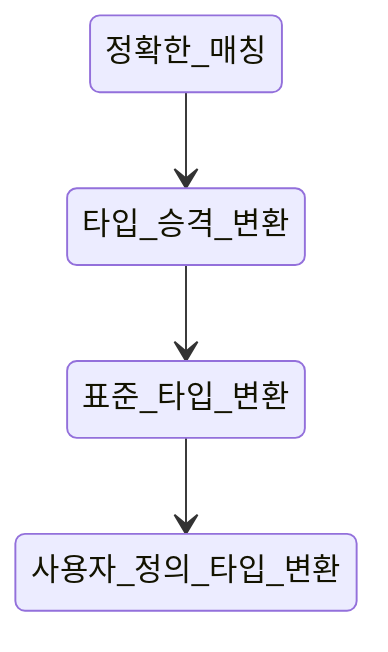

#### 함수 오버로딩

- C++에서 함수 이름과 매개변수 타입 정보를 함께 사용해 구분한다
- 동일한 이름의 함수를 여러 개 정의할 수 있는 것을 **`함수 오버로딩`** 이라고 한다
- 함수 이름 구분을 위해 내부적으로 고유한 이름을 부여하는 것을 **`네임 맹글링(Name Mangling)`** 이라고 한다

- 매개변수 타입이 다른 함수 오버로딩
```
// 목적: 함수 오버로딩의 개념을 매개변수 타입이 다른 경우로 이해하기  
#include <iostream>  
using namespace std;  
    void print(int a) {  
    cout << "정수 출력: " << a << endl;  
}  
    void print(double a) {  
    cout << "실수 출력: " << a << endl;  
}  
    int main() {  
    print(10);     // 정수 출력  
    print(3.14);   // 실수 출력  
    return 0;  
}  
    // 출력결과:  
// 정수 출력: 10  
// 실수 출력: 3.14
```

- 매개변수 개수 다른 함수 오버로딩
```
// 목적: 매개변수의 개수가 달라서 함수 오버로딩이 유효한 경우를 확인하기  
#include <iostream>  
using namespace std;  
    int add(int a, int b) {  
    return a + b;  
}  
    int add(int a, int b, int c) {  
    return a + b + c;  
}  
    int main() {  
    cout << add(1, 2) << endl;        // 두 개의 인자 사용  
    cout << add(1, 2, 3) << endl;     // 세 개의 인자 사용  
    return 0;  
}  
    // 출력결과:  
// 3  
// 6
```


#### 오버로딩이 되지 않는 경우

- 타입 변환이 가능한 매개변수로 인해 두 개 이상의 오버로딩된 함수가 호출 후보가 되는 경우
```
// 목적: 타입 변환 가능한 매개변수로 인해 애매모호성이 발생하는 예시  
#include <iostream>  
using namespace std;  
void print(double a) {  
    cout << "double: " << a << endl;  
}  
void print(long a) {  
    cout << "long: " << a << endl;  
}  
int main() {  
    // print(10);  // int는 long과 double 모두로 변환 가능하므로 애매모호  
    return 0;  
}  
/*  
출력결과 (컴파일 에러):  
error: call of overloaded 'print(int)' is ambiguous  
*/
```

- 디폴트 매개변수로 인해 함수 호출 형태가 중복되는 경우
```
// 목적: 디폴트 매개변수로 인해 호출 형태가 중복되는 경우  
#include <iostream>  
using namespace std;  
void display(int a, int b = 5) {  
    cout << a << ", " << b << endl;  
}  
void display(int a) {  
    cout << a << endl;  
}  
int main() {  
    // display(10); // 디폴트 매개변수로 인해 두 함수 모두 호출 가능하므로 애매모호  
    return 0;  
}  
/*  
출력결과 (컴파일 에러):  
error: call of overloaded 'display(int)' is ambiguous  
*/
```

- 매개변수의 타입만 포인터와 배열로 다른 경우 매개변수의 타입만 포인터와 배열로 다른 경우
```
// 목적: 매개변수의 타입이 포인터와 배열일 때 애매모호성 발생 예시  
#include <iostream>  
using namespace std;  
void print(int* arr) {  
    cout << "포인터 호출됨" << endl;  
}  
void print(int arr[]) {  
    cout << "배열 호출됨" << endl;  
}  
int main() {  
    int data[3] = {1, 2, 3};  
    // print(data); // 포인터와 배열은 같은 타입으로 취급되어 애매모호  
    return 0;  
}  
/*  
출력결과 (컴파일 에러):  
error: redefinition of 'void print(int*)'  
배열과 포인터는 매개변수로 구분되지 않음  
*/
```

- 함수의 반환 타입만 다른 경우
```
// 목적: 반환 타입만 다른 함수 오버로딩으로 애매모호성 발생  
#include <iostream>  
using namespace std;  
// int getValue() {  
//     return 10;  
// }  
// double getValue() {  
//     return 3.14;  
// }  
int main() {  
    // cout << getValue(); // 반환 타입만으로는 함수를 구별할 수 없으므로 애매모호  
    return 0;  
}  
/*  
출력결과 (컴파일 에러):  
error: functions that differ only in their return type cannot be overloaded  
*/
```


#### 함수 오버로딩의 순서



- 정확한 매개변수 타입 일치
    - 호출 인자 타입과 매개변수 타입이 정확히 일치하는 경우
```
// 목적: 정확한 매개변수 타입이 우선적으로 선택됨을 학습  
#include <iostream>  
using namespace std;  
void print(int a) {  
    cout << "정확한 타입(int) 호출됨" << endl;  
}  
void print(double a) {  
    cout << "double 타입 호출됨" << endl;  
}  
int main() {  
    print(10); // 정확한 int 타입 일치  
    return 0;  
}  
// 출력결과:  
// 정확한 타입(int) 호출됨
```

- 타입 승격 변환
    - 값이 손실되지 않는 방향으로 변환하는 것을 승격이라 한다
        - `char` or `short` -> `int`
        - `float` -> `double`
        - `bool` -> `int`
```
// 목적: 정확한 타입이 없으면 타입 승격 변환이 우선적으로 선택됨을 학습  
#include <iostream>  
using namespace std;  
void print(int a) {  
    cout << "int 타입 호출됨" << endl;  
}  
void print(char a) {  
    cout << "char 타입 호출됨" << endl;  
}  
int main() {  
    short s = 10;  
    print(s);  // short에서 int로 승격 변환  
    return 0;  
}  
// 출력결과:  
// int 타입 호출됨
```

- 표준 타입 변환
    - 승격보다는 조금 더 광범위
    - 값 손실이 발생하는 경우도 있다
        - `int` -> `double`
        - `double` -> `int`
        - `double` -> `float`
```
// 목적: double 값을 오버로딩된 int 또는 string 함수에 전달할 때, 변환 우선순위 확인  
#include <iostream>  
#include <string>  
using namespace std;  
void print(int a) {  
    cout << "int 버전 호출됨: " << a << endl;  
}  
void print(string a) {  
    cout << "string 버전 호출됨: " << a << endl;  
}  
int main() {  
    double num = 10.99;  
        print(num); // double → int 변환이 발생하여 int 버전 호출  
    return 0;  
}  
// 출력결과:  
// int 버전 호출됨: 10
```

- 사용자 정의 타입 변환
    - 클래스 타입의 변환 함수나 생성자 등을 통해 이뤄지는 변환
```
// 목적: 표준 변환이 불가능하면 사용자 정의 변환이 호출됨을 학습  
#include <iostream>  
using namespace std;  
    class MyNumber {  
public:  
    operator int() const { return 42; }  
};  
void print(int a) {  
    cout << "int 타입 호출됨, 값: " << a << endl;  
}  
void print(double a) {  
    cout << "double 타입 호출됨, 값: " << a << endl;  
}  
int main() {  
    MyNumber num;  
    print(num);  // 사용자 정의 변환을 통해 MyNumber→int로 변환됨  
    return 0;  
}  
// 출력결과:  
// int 타입 호출됨, 값: 42
```


#### 템플릿

- 타입에 관계없이 일반화된 코드를 작성하기 위한 문법
- 템플릿을 이용한 일반화된 함수는 `template <typename T>`로 정의한다


#### 템플릿 클래스

- 함수뿐만 아니라, 클래스도 템플릿으로 사용해 일반화할 수 있다
```
// 목적: 클래스 템플릿으로 배열을 일반화하여 원소 추가 및 삭제 기능 구현하기  
#include <iostream>  
using namespace std;
 
template <typename T>  
class Array {  
    T data[100];  
    int size; 
 
public:  
    Array() : size(0) {}
  
    void add(const T& element) {  
        if(size < 100)  
            data[size++] = element;  
    }  
  
    void remove() {  
        if(size > 0)  
            size--;  
    }    

    void print() {  
        for(int i = 0; i < size; i++)  
            cout << data[i] << " ";  
        cout << endl;  
    }
};  

int main() {  
    Array<int> arr; // 정수형 배열 생성  
    arr.add(10);  
    arr.add(20);  
    arr.add(30);  
    arr.print();  
    arr.remove();  
    arr.print();  
    return 0;  
}  

// 출력결과:  
// 10 20 30  
// 10 20
```