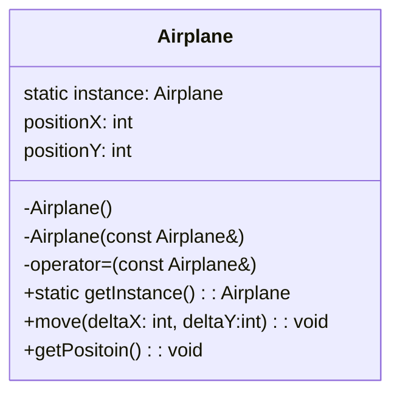
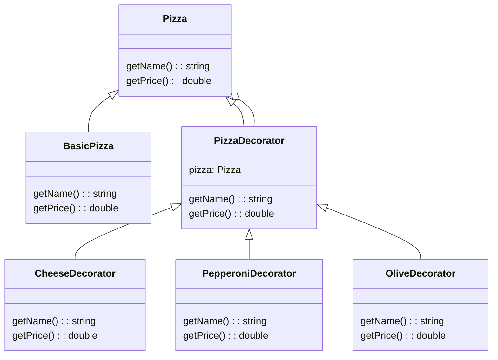
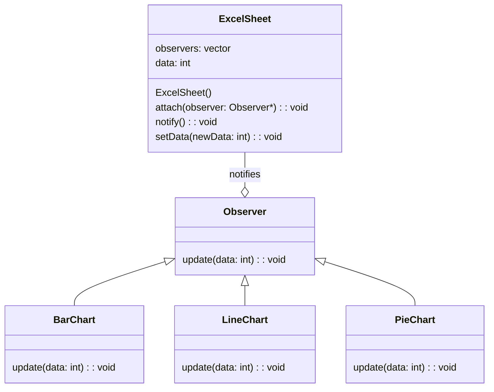

#### 디자인 패턴

- 개발 시 반복적으로 등장하는 문제를 해결하기 위한 일반화 된 솔루션

![[디자인 패턴.png]]

#### 생성 패턴(Creational Patterns)

- 새로운 것을 만들어내는 방법과 관련된 패턴
- 예를 들어 공장에서 물건을 찍어내는 것에 비유할 수 있다
- **싱글톤 패턴(Singleton)**
    - 아래와 같은 요구사항을 가정
        - 비행기 관리
        1. 게임 내 비행기는 오직 하나만 존재
        2. 비행기의 초기 위치는 (0,0) 좌표

        - 비행기 이동
        1. 비행기는 `move(int deltaX, int deltaY)` 메서드를 통해 이동하고, 위치를 업데이트
        2. 현재 비행기 좌표를 확인할 수 있는 `getPosition()`을 제공

     - 문제 상황
         - 비행기 게임을 만들려고 한다
         - 이 때 게임 내 제어하는 비행기는 반드시 하나만 존재
         - 어떻게 하면 내가 만든 프로그램에서 비행기가 하나만 존재하도록 구현할까?
            1. 생성 및 대입을 `private`으로 했다
            2. `getInstance()`를 통해서만 인스턴스를 받는다




```
    #include <iostream>
    using namespace std;
    
    class Airplane {
    private:
        static Airplane* instance; // 유일한 비행기 객체를 가리킬 정적 포인터
        int positionX;             // 비행기의 X 위치
        int positionY;             // 비행기의 Y 위치
    
        // private 생성자: 외부에서 객체 생성 금지
        Airplane() : positionX(0), positionY(0) {
            cout << "Airplane Created at (" << positionX << ", " << positionY << ")" << endl;
        }
    
    public:
        // 복사 생성자와 대입 연산자를 삭제하여 복사 방지
        Airplane(const Airplane&) = delete;
        Airplane& operator=(const Airplane&) = delete;
    
        // 정적 메서드: 유일한 비행기 인스턴스를 반환
        static Airplane* getInstance() {
            if (instance == nullptr) {
                instance = new Airplane();
            }
            return instance;
        }
    
        // 비행기 위치 이동
        void move(int deltaX, int deltaY) {
            positionX += deltaX;
            positionY += deltaY;
            cout << "Airplane moved to (" << positionX << ", " << positionY << ")" << endl;
        }
    
        // 현재 위치 출력
        void getPosition() const {
            cout << "Airplane Position: (" << positionX << ", " << positionY << ")" << endl;
        }
    };
    
    // 정적 멤버 초기화
    Airplane* Airplane::instance = nullptr;
    
    // 메인 함수 (사용 예시)
    int main() {
        // 유일한 비행기 인스턴스를 가져옴
        Airplane* airplane = Airplane::getInstance();
        airplane->move(10, 20);  // 비행기 이동
        airplane->getPosition();
    
        // 또 다른 요청도 같은 인스턴스를 반환
        Airplane* sameAirplane = Airplane::getInstance();
        sameAirplane->move(-5, 10); // 비행기 이동
        sameAirplane->getPosition();
    
        return 0;
    }
```

#### 구조 패턴(Structual Patterns)

- 여러 부품을 어떻게 조립하고 연결하는 방법에 대한 패턴
- 여러 개의 객체들의 구조를 어떻게 구성할 지가 이 패턴의 주 관심사
- **데코레이터 패턴(Decorator)**
    - 아래와 같은 요구사항을 가정
        - 기본 피자
        1. 피자의 기본 베이스가 반드시 필요
        2. 기본 피자에는 이름과 가격이 정의

        - 토핑 추가
        1. 피자에 토핑(치즈, 페퍼로니, 올리브)를 동적으로 추가 가능
        2. 토핑은 이름과 추가 비용을 가짐

        - 피자 정보 제공
        1. 최종 피자의 이름(기본 피자 + 추가된 토핑들)과 가격을 제공

     - 문제 상황
         - 피자를 만들려고 한다
         - 이 때 피자의 토핑을 원하는 대로 추가하면서 동적으로 피자를 만들 수 있어야 함
         - 어떻게 하면 객체의 상태를 동적으로 업데이트할 수 있을까?
            1. 기본 피자 클래스가 있고 데코레이터 클래스가 추가로 있다
            2. 데코레이터 클래스는 피자 객체를 감싸며 동적으로 새로운 기능을 제공
            3. 원하는 토핑을 조합하여 피자를 구성할 수 있고, 새로운 토핑을 추가하면 기능 확장이 쉽게 가능



```
    #include <iostream>
    #include <string>
    
    using namespace std;
    
    // **추상 컴포넌트 (Component): Pizza**
    // - 피자 객체의 기본 구조를 정의하는 인터페이스입니다.
    // - 모든 피자는 이름(`getName`)과 가격(`getPrice`)을 가져야 합니다.
    class Pizza {
    public:
        virtual ~Pizza() {}
        virtual string getName() const = 0;  // 피자의 이름 반환
        virtual double getPrice() const = 0; // 피자의 가격 반환
    };
    
    // **구체 컴포넌트 (Concrete Component): BasicPizza**
    // - 기본 피자 클래스입니다.
    // - 피자의 기본 베이스(이름과 가격)를 구현합니다.
    class BasicPizza : public Pizza {
    public:
        string getName() const {
            return "Basic Pizza"; // 기본 피자의 이름
        }
        double getPrice() const {
            return 5.0; // 기본 피자의 가격
        }
    };
    
    // **데코레이터 추상 클래스 (Decorator): PizzaDecorator**
    // - 기존 피자의 기능을 확장하기 위한 데코레이터의 기본 구조를 정의합니다.
    // - 내부적으로 `Pizza` 객체를 감싸며, 이름과 가격에 추가적인 기능을 제공합니다.
    class PizzaDecorator : public Pizza {
    protected:
        Pizza* pizza; // 기존의 피자 객체를 참조합니다.
    public:
        // 데코레이터는 피자 객체를 받아서 감쌉니다.
        PizzaDecorator(Pizza* p) : pizza(p) {}
        
        // 소멸자에서 내부 피자 객체를 삭제합니다.
        virtual ~PizzaDecorator() {
            delete pizza;
        }
    };
    
    // **구체 데코레이터 (Concrete Decorators): Cheese, Pepperoni, Olive**
    // - 각각의 토핑 데코레이터는 `PizzaDecorator`를 상속받아 이름과 가격을 확장합니다.
    
    // 치즈 토핑 데코레이터
    class CheeseDecorator : public PizzaDecorator {
    public:
        CheeseDecorator(Pizza* p) : PizzaDecorator(p) {}
        string getName() const {
            // 기존 피자의 이름에 " + Cheese"를 추가
            return pizza->getName() + " + Cheese";
        }
        double getPrice() const {
            // 기존 피자의 가격에 치즈 추가 비용 1.5를 더함
            return pizza->getPrice() + 1.5;
        }
    };
    
    // 페퍼로니 토핑 데코레이터
    class PepperoniDecorator : public PizzaDecorator {
    public:
        PepperoniDecorator(Pizza* p) : PizzaDecorator(p) {}
        string getName() const {
            // 기존 피자의 이름에 " + Pepperoni"를 추가
            return pizza->getName() + " + Pepperoni";
        }
        double getPrice() const {
            // 기존 피자의 가격에 페퍼로니 추가 비용 2.0을 더함
            return pizza->getPrice() + 2.0;
        }
    };
    
    // 올리브 토핑 데코레이터
    class OliveDecorator : public PizzaDecorator {
    public:
        OliveDecorator(Pizza* p) : PizzaDecorator(p) {}
        string getName() const {
            // 기존 피자의 이름에 " + Olive"를 추가
            return pizza->getName() + " + Olive";
        }
        double getPrice() const {
            // 기존 피자의 가격에 올리브 추가 비용 0.7을 더함
            return pizza->getPrice() + 0.7;
        }
    };
    
    // **클라이언트 코드**
    // - 피자와 데코레이터를 조합하여 최종 피자를 생성하고, 정보를 출력합니다.
    int main() {
        // 1. 기본 피자를 생성합니다.
        Pizza* pizza = new BasicPizza();
    
        // 2. 치즈 토핑을 추가합니다.
        pizza = new CheeseDecorator(pizza);
    
        // 3. 페퍼로니 토핑을 추가합니다.
        pizza = new PepperoniDecorator(pizza);
    
        // 4. 올리브 토핑을 추가합니다.
        pizza = new OliveDecorator(pizza);
    
        // 5. 최종 피자 정보 출력
        cout << "Pizza: " << pizza->getName() << endl; // 피자의 이름 출력
        cout << "Price: $" << pizza->getPrice() << endl; // 피자의 가격 출력
    
        // 6. 메모리 해제
        delete pizza;
    
        return 0;
    }
```

#### 행동 패턴(Behavioral Patterns)

- 부품이 서로 어떻게 상호작용 할 지에 대한 패턴
- 예를 들어 특정 객체가 변할 때 다른 객체들에 이상태를 어떻게 전달할 지에 대한 고민들
- **옵저버 패턴(Observer)**
    - 아래와 같은 요구사항을 가정
        - 엑셀 프로그램을 만들려고 한다
        - 엑셀 데이터 값을 변경할 때 해당 데이터로 생성한 모든 차트의 데이터가 반영되도록 하려한다
        - 차트의 개수나 종류가 많을때 매번 각 차트의 데이터를 수동으로 업데이터 하는 것은 비효율
        - 어떻게 하면 이를 자동으로 할 수 있을까?

     - 엑셀 시트와 차트 관리
        1. 엑셀 시트는 데이터를 입력 받을 수 있다
        2. 여러 차트는 엑셀 데이터를 기반으로 업데이트
        3. 엑셀에 새로운 값이 입력되면 연결된 모든 차트가 자동으로 업데이트



- **Subject**
    - 상태를 관리하고 변경되었음을 옵저버에 알림
- **Observer**
    - `Subject`를 관찰하며 상태 변경 시 반응
- **연결 구조**
    - `Observer`들은 `Subject`에 등록하고 변경이 발생하면 알람을 받음

```
    #include <iostream>
    #include <vector>
    #include <string>
    using namespace std;
    
    // Observer 인터페이스
    // - Observer 패턴에서 상태 변화를 알림받는 객체들의 공통 인터페이스
    // - Observer들은 이 인터페이스를 구현하여 `update` 메서드를 통해 데이터를 전달받음
    class Observer {
    public:
        virtual ~Observer() = default;               // 가상 소멸자
        virtual void update(int data) = 0;           // 데이터 업데이트 메서드 (순수 가상 함수)
    };
    
    // Subject 클래스 (엑셀 시트 역할)
    // - 데이터의 상태 변화를 관리하며, 모든 등록된 Observer들에게 변경 사항을 알림
    class ExcelSheet {
    private:
        vector<Observer*> observers;                 // Observer들을 저장하는 리스트
        int data;                                    // 현재 데이터 상태
    
    public:
        ExcelSheet() : data(0) {}                    // 생성자: 초기 데이터 값은 0
    
        // Observer 등록 메서드
        // - 새로운 Observer를 등록하여 변경 사항 알림을 받을 수 있도록 추가
        void attach(Observer* observer) {
            observers.push_back(observer);
        }
    
        // 데이터 변경 알림 메서드
        // - 등록된 모든 Observer들의 `update` 메서드를 호출하여 데이터 변경 사항을 알림
        void notify() {
            for (Observer* observer : observers) {
                observer->update(data);              // 각 Observer에게 데이터를 전달
            }
        }
    
        // 데이터 설정 메서드
        // - 데이터를 변경하고 변경 사항을 모든 Observer에게 알림
        void setData(int newData) {
            data = newData;                          // 새로운 데이터로 갱신
            cout << "ExcelSheet: Data updated to " << data << endl;
            notify();                                // Observer들에게 알림
        }
    };
    
    // 구체적인 Observer 클래스: BarChart (막대 차트)
    // - 데이터를 막대 그래프로 표현
    class BarChart : public Observer {
    public:
        void update(int data) {                      // 데이터 업데이트 시 호출됨
            cout << "BarChart: Displaying data as vertical bars: ";
            for (int i = 0; i < data; ++i) {
                cout << "|";                         // 데이터 값만큼 막대 출력
            }
            cout << " (" << data << ")" << endl;
        }
    };
    
    // 구체적인 Observer 클래스: LineChart (라인 차트)
    // - 데이터를 선형 그래프로 표현
    class LineChart : public Observer {
    public:
        void update(int data) {                      // 데이터 업데이트 시 호출됨
            cout << "LineChart: Plotting data as a line: ";
            for (int i = 0; i < data; ++i) {
                cout << "-";                         // 데이터 값만큼 선 출력
            }
            cout << " (" << data << ")" << endl;
        }
    };
    
    // 구체적인 Observer 클래스: PieChart (파이 차트)
    // - 데이터를 파이 그래프로 표현
    class PieChart : public Observer {
    public:
        void update(int data) {                      // 데이터 업데이트 시 호출됨
            cout << "PieChart: Displaying data as a pie chart slice: ";
            cout << "Pie [" << data << "%]" << endl; // 데이터 값 출력 (가정: % 비율로 표현)
        }
    };
    
    // 메인 함수
    int main() {
        // Subject 생성
        ExcelSheet excelSheet;                       // 데이터를 관리하는 엑셀 시트 객체 생성
    
        // Observer 객체 생성 (각 차트 객체)
        BarChart* barChart = new BarChart();         // 막대 차트 생성
        LineChart* lineChart = new LineChart();      // 라인 차트 생성
        PieChart* pieChart = new PieChart();         // 파이 차트 생성
    
        // Observer 등록
        // - 각 차트(Observer)를 엑셀 시트(Subject)에 등록
        excelSheet.attach(barChart);
        excelSheet.attach(lineChart);
        excelSheet.attach(pieChart);
    
        // 데이터 변경 테스트
        // - 데이터를 변경하면 등록된 모든 Observer들이 알림을 받고 화면에 갱신
        excelSheet.setData(5);                       // 데이터 변경: 5
        excelSheet.setData(10);                      // 데이터 변경: 10
    
        // 메모리 해제
        // - 동적 할당된 Observer(차트) 객체 삭제
        delete barChart;
        delete lineChart;
        delete pieChart;
    
        return 0;
    }
```