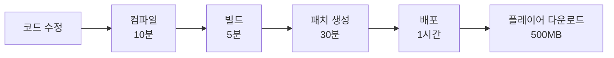

#### 레퍼런스의 이해 - 언리얼 메모리 관리

##### 하드 레퍼런스 (Hard Reference)

- 정의 : "내가 이거 쓸 거니까 미리 다 준비해놔"

```
UCLASS()
class AMyCharacter : public ACharacter
{
    UPROPERTY(EditDefaultsOnly)
    USkeletalMesh* CharacterMesh;  // 하드 레퍼런스!

    UPROPERTY(EditDefaultsOnly)
    UTexture2D* CharacterIcon;     // 이것도 하드 레퍼런스!
};
```

- 동작 방식

```
graph LR
    A[MyCharacter 로드] --> B[CharacterMesh 자동 로드<br/>50MB]
    A --> C[CharacterIcon 자동 로드<br/>4MB]
    A --> D[연결된 모든 에셋 로드]

```

- 실제 문제 예시

```
// 이렇게 하면 큰일납니다
class AWarriorCharacter : public ACharacter
{
    UPROPERTY()
    USkeletalMesh* WarriorMesh;        // 50MB

    UPROPERTY()
    TArray<UTexture2D*> ArmorTextures; // 각 4MB × 10개 = 40MB

    UPROPERTY()
    TArray<USoundBase*> VoiceLines;    // 각 2MB × 20개 = 40MB

    UPROPERTY()
    UAnimationAsset* IdleAnimation;    // 10MB
    UAnimationAsset* WalkAnimation;    // 10MB
    UAnimationAsset* RunAnimation;     // 10MB
    // ... 더 많은 애니메이션들
};
```

|캐릭터 구성|메모리 사용량|
|---|---|
|SkeletalMesh|50MB|
|Textures (10개)|40MB|
|Sounds (20개)|40MB|
|Animations (3개)|30MB|
|**총합**|**160MB**

>10명 캐릭터 = 1.6 GB -> PS5 (16 GB RAN) 터짐


##### 소프트 레퍼런스 (Soft Reference)

- 정의 : "일단 어디 있는지만 기억해두고, 필요할 때 가져올게"

```
// Lyra 방식 - 똑똑한 방법
class ALyraCharacter : public ACharacter
{
    UPROPERTY(EditDefaultsOnly)
    TSoftObjectPtr<USkeletalMesh> CharacterMesh;  // 경로만 저장! (몇 바이트)

    UPROPERTY(EditDefaultsOnly)
    TSoftObjectPtr<UTexture2D> CharacterIcon;     // 경로만 저장! (몇 바이트)
};
```

- TSofObjectPtr 구조 분석
	- `T` = Template (템플릿) - "어떤 타입이든 가능"
	- `Soft` = 소프트 레퍼런스 - "경로만 저장"
	- `Object` = 언리얼 오브젝트 - "언리얼 에셋"
	- `Ptr` = Pointer - "가리키는 것"
>쉽게 말해 : "주소만 적어둔 메모장"


##### 소프트 레퍼런스 사용법

- 방법 1 : 동기 로드 (Synchronous)

```
void ALyraCharacter::EquipCharacterMesh()
{
    // 경로 정보가 있는지 먼저 확인
    if (!CharacterMesh.IsNull())
    {
        // 경로에 해당하는 리소스를 즉시 로드!
        USkeletalMesh* LoadedMesh = CharacterMesh.LoadSynchronous();
        
        if (LoadedMesh)
        {
            GetMesh()->SetSkeletalMesh(LoadedMesh);
            UE_LOG(LogTemp, Log, TEXT("메시 로드 완료!"));
        }
    }
}
```

- 방법 2: 비동기 로드 (Asynchronous)

```
void ALyraCharacter::EquipCharacterMeshAsync()
{
    if (!CharacterMesh.IsNull())
    {
        // AssetManager에게 "백그라운드에서 로드해줘!" 요청
        FStreamableManager& Streamable = UAssetManager::GetStreamableManager();
        
        UE_LOG(LogTemp, Log, TEXT("메시 로드 시작..."));
        
        Streamable.RequestAsyncLoad(
            CharacterMesh.ToSoftObjectPath(),
            FStreamableDelegate::CreateWeakLambda(this, [this]()
            {
                // 로드가 끝나면 이 부분이 실행돼요
                if (USkeletalMesh* LoadedMesh = CharacterMesh.Get())
                {
                    GetMesh()->SetSkeletalMesh(LoadedMesh);
                    UE_LOG(LogTemp, Log, TEXT("메시 로드 완료!"));
                }
                else
                {
                    UE_LOG(LogTemp, Error, TEXT("메시 로드 실패!"));
                }
            })
        );
    }
}
```


##### 레퍼런스 타입 비교

```
// 오브젝트(에셋)용
TSoftObjectPtr<USkeletalMesh> MeshPath;        // 메시 파일 경로
TSoftObjectPtr<UTexture2D> TexturePath;        // 텍스처 파일 경로

// 클래스용
TSoftClassPtr<AWeapon> WeaponClassPath;        // 무기 클래스 경로
TSoftClassPtr<UGameplayAbility> AbilityPath;   // 능력 클래스 경로
```

|타입|용도|예시|
|---|---|---|
|`TSoftObjectPtr<T>`|에셋 인스턴스|메시, 텍스처, 사운드|
|`TSoftClassPtr<T>`|클래스 타입|Actor, Component, Ability|


#### Asset Manager와 Bundle System - 언리얼 에셋 관리

##### Primary Asset

- 정의 : Asset Manager가 특별 관리하는 중요 에셋

```
// Primary Asset으로 승격시키는 방법
class UWeaponDataAsset : public UPrimaryDataAsset  // 이 한 줄이 핵심!
{
    GENERATED_BODY()
    
public:
    // Asset Manager가 식별할 수 있게 '신분증' 발급
    virtual FPrimaryAssetId GetPrimaryAssetId() const override
    {
        // Type: "Weapon" / Name: 파일 이름
        return FPrimaryAssetId(TEXT("Weapon"), GetFName());
    }
    
    UPROPERTY(EditDefaultsOnly)
    TSoftObjectPtr<USkeletalMesh> WeaponMesh;
    
    UPROPERTY(EditDefaultsOnly)
    TSoftObjectPtr<UTexture2D> WeaponIcon;
};
```


##### Bundle System

- Bundle 정의

```
namespace EAssetBundle
{
    const FName Menu("Menu");          // UI용 최소 데이터
    const FName Gameplay("Gameplay");  // 게임플레이 데이터
    const FName Visual("Visual");      // 3D 리소스
    const FName Audio("Audio");        // 사운드
}
```

- 상황 1: 캐릭터 선택 화면

```
// 메뉴 번들만 로드 (가볍고 빠르게)
UAssetManager::Get().LoadPrimaryAsset(
    CharacterId, 
    {EAssetBundle::Menu}  // 썸네일, 이름, 설명만
);
```

- 상황 2: 게임 시작 준비

```
// 메뉴 + 게임플레이 번들 로드
UAssetManager::Get().LoadPrimaryAsset(
    CharacterId, 
    {EAssetBundle::Menu, EAssetBundle::Gameplay}  // UI + 스탯 데이터
);
```

- 상황 3: 실제 월드에 스폰

```
// 전체 번들 로드 (풀 세트!)
UAssetManager::Get().LoadPrimaryAsset(
    CharacterId, 
    {EAssetBundle::Menu, EAssetBundle::Gameplay, EAssetBundle::Visual}
);
```

- 상황 4: 거리별 최적화

```
// 거리에 따른 적응적 로딩
if (Distance > 1000.0f)
{
    // 멀리: 게임플레이만 (AI 계산용)
    LoadPrimaryAsset(EnemyId, {EAssetBundle::Gameplay});
}
else if (Distance > 500.0f)
{
    // 중간: 게임플레이 + 비주얼
    LoadPrimaryAsset(EnemyId, {EAssetBundle::Gameplay, EAssetBundle::Visual});
}
else
{
    // 가까이: 모든 것 (사운드까지)
    LoadPrimaryAsset(EnemyId, {EAssetBundle::Gameplay, EAssetBundle::Visual, EAssetBundle::Audio});
}
```

- 프로젝트 설정
	- Project Settings -> Game -> Asset Manager

```
Primary Asset Types:
├── "Weapon"
│   ├── Base Class: UWeaponDataAsset
│   └── Directory: /Game/Data/Weapons
├── "PawnData"
│   ├── Base Class: UPawnDataAsset
│   └── Directory: /Game/Data/Pawns
└── "Experience"
    ├── Base Class: ULyraExperienceDefinition
    └── Directory: /Game/Data/Experiences
```


#### 데이터 중심 설계의 3단계 진화 (Lyra로의 진화)

##### Level 1: 값 추출 (Value Extraction)

- 목표 : 하드코딩된 숫자를 외부 파일로 분리

- Step 1: 구조체 정의

```
USTRUCT(BlueprintType)
struct FWeaponStats : public FTableRowBase  // 중요! FTableRowBase 상속
{
    GENERATED_BODY()

    UPROPERTY(EditAnywhere)
    float Damage = 10.0f;

    UPROPERTY(EditAnywhere)
    float FireRate = 1.0f;

    UPROPERTY(EditAnywhere)
    float Range = 500.0f;
};
```

- Step 2: CSV 파일 생성

```
Name,Damage,FireRate,Range
Pistol,25,0.3,800
Rifle,40,0.1,1500
Shotgun,100,1.0,300
```

- Step 3: 에디터에서 임포트
1. CSV 파일을 Content Browser로 드래그
2. "DataTable" 선택
3. Row Structure에서 `FWeaponStats` 선택
4. Import!

- Step 4: 코드에서 사용

```
class AWeapon : public AActor
{
    // 에디터에서 DataTable 연결
    UPROPERTY(EditDefaultsOnly)
    UDataTable* WeaponStatsTable;

    // 무기 종류
    UPROPERTY(EditAnywhere)
    FName WeaponType = "Pistol";

    // 실제 사용할 값들
    float Damage;
    float FireRate;
    float Range;

    void BeginPlay()
    {
        // DataTable이 있는지 확인
        if (WeaponStatsTable)
        {
            // WeaponType 이름으로 행 찾기
            FWeaponStats* Stats = WeaponStatsTable->FindRow<FWeaponStats>(
                WeaponType,
                TEXT("WeaponStats")  // 디버그용 컨텍스트
            );

            // 찾았으면 값 적용
            if (Stats)
            {
                Damage = Stats->Damage;
                FireRate = Stats->FireRate;
                Range = Stats->Range;
            }
        }
    }
};
```

- 결과
	- 디자이너가 CSV만 수정 -> 즉시 밸런싱


##### Level 2: 동작 추상화 (Behavior Abstraction)

- 목표 : 행동 방식 자체를 데이터로 교체
- DataAsset + Ability

- WeaponDataAsset 정의

```
UCLASS(BlueprintType)
class UWeaponDataAsset : public UPrimaryDataAsset  // Primary Asset!
{
    GENERATED_BODY()

public:
    // 무기 기본 정보
    UPROPERTY(EditDefaultsOnly, Category = "Info")
    FText WeaponName;

    UPROPERTY(EditDefaultsOnly, Category = "Info")
    FText Description;

    // 발사 동작을 Ability로!
    UPROPERTY(EditDefaultsOnly, Category = "Combat")
    TSoftClassPtr<UGameplayAbility> PrimaryFireAbility;  // 주 발사

    UPROPERTY(EditDefaultsOnly, Category = "Combat")
    TSoftClassPtr<UGameplayAbility> SecondaryFireAbility; // 보조 발사

    // 비주얼
    UPROPERTY(EditDefaultsOnly, Category = "Visual")
    TSoftObjectPtr<UStaticMesh> WeaponMesh;

    // 애니메이션
    UPROPERTY(EditDefaultsOnly, Category = "Animation")
    TSoftObjectPtr<UAnimMontage> FireMontage;

    // 이펙트
    UPROPERTY(EditDefaultsOnly, Category = "Effects")
    TSoftObjectPtr<UNiagaraSystem> MuzzleFlash;

    // Primary Asset ID (Asset Manager가 관리)
    virtual FPrimaryAssetId GetPrimaryAssetId() const override
    {
        return FPrimaryAssetId(TEXT("Weapon"), GetFName());
    }
};

```

- 다양한 발사 Ability 만들기

```
// GA_Fire_Single.cpp - 단발 사격
UCLASS()
class UGA_Fire_Single : public UGameplayAbility
{
    void ActivateAbility(...)
    {
        // 한 발만 쏜다
        SpawnProjectile();
        PlayMontage(FireAnimation);
        SpawnMuzzleFlash();
    }
};

// GA_Fire_Burst.cpp - 3점사
UCLASS()
class UGA_Fire_Burst : public UGameplayAbility
{
    void ActivateAbility(...)
    {
        // 3발 연속 발사
        for (int i = 0; i < 3; i++)
        {
            SpawnProjectile();
            Wait(0.1f);
        }
    }
};
```

- 무기 장착 시 사용

```
void ACharacter::EquipWeapon(UWeaponDataAsset* WeaponData)
{
    if (!WeaponData) return;

    UE_LOG(LogTemp, Warning, TEXT("Equipping: %s"), *WeaponData->WeaponName.ToString());

    // 1. Ability 로드 및 부여
    if (!WeaponData->PrimaryFireAbility.IsNull())
    {
        // 소프트 레퍼런스 로드
        TSubclassOf<UGameplayAbility> AbilityClass =
            WeaponData->PrimaryFireAbility.LoadSynchronous();

        if (AbilityClass)
        {
            // 기존 발사 능력 제거
            if (CurrentFireAbilityHandle.IsValid())
            {
                AbilitySystemComponent->ClearAbility(CurrentFireAbilityHandle);
            }

            // 새 발사 능력 부여
            FGameplayAbilitySpec AbilitySpec(AbilityClass, 1, 0, this);
            CurrentFireAbilityHandle = AbilitySystemComponent->GiveAbility(AbilitySpec);

            UE_LOG(LogTemp, Warning, TEXT("Fire ability granted!"));
        }
    }

    // 2. 비주얼 로드
    if (!WeaponData->WeaponMesh.IsNull())
    {
        UStaticMesh* Mesh = WeaponData->WeaponMesh.LoadSynchronous();
        if (Mesh && WeaponMeshComponent)
        {
            WeaponMeshComponent->SetStaticMesh(Mesh);
        }
    }

    // 3. 애니메이션 저장
    if (!WeaponData->FireMontage.IsNull())
    {
        CurrentFireMontage = WeaponData->FireMontage.LoadSynchronous();
    }
}
```

- 결과
	- 발사 방식 변경 = DataAsset에서 Ablity만 교체


##### Level 3: 정의 데이터화 (Definition as Data)

-  목표 : 게임 자체를 데이터로 정의

- 계층 구조

```
Experience (게임 모드)
    ├── PawnData (캐릭터 정의)
    │   ├── Abilities
    │   ├── InputConfig
    │   └── Components
    └── GameFeatures
```

- Experience 정의

```
UCLASS()
class ULyraExperienceDefinition : public UPrimaryDataAsset
{
    GENERATED_BODY()

public:
    // 이 게임 모드의 이름
    UPROPERTY(EditDefaultsOnly, Category = "Info")
    FText ExperienceName;

    // 사용 가능한 캐릭터들
    UPROPERTY(EditDefaultsOnly, Category = "Gameplay")
    TMap<FGameplayTag, UPawnDataAsset*> AvailablePawns;

    // 게임 규칙
    UPROPERTY(EditDefaultsOnly, Category = "Rules")
    TSubclassOf<AGameMode> GameModeClass;

    // 추가 기능들 (리스폰, 점수, 스톰 등)
    UPROPERTY(EditDefaultsOnly, Category = "Features")
    TArray<FString> GameFeaturesToLoad;

    // UI
    UPROPERTY(EditDefaultsOnly, Category = "UI")
    TSoftClassPtr<UHUD> HUDClass;

    // 기본 맵
    UPROPERTY(EditDefaultsOnly, Category = "Level")
    TSoftObjectPtr<UWorld> DefaultMap;

    virtual FPrimaryAssetId GetPrimaryAssetId() const override
    {
        return FPrimaryAssetId(TEXT("Experience"), GetFName());
    }
};
```

- Pawn Data 정의

```
UCLASS()
class UPawnDataAsset : public UPrimaryDataAsset
{
    GENERATED_BODY()

public:
    // 캐릭터 이름
    UPROPERTY(EditDefaultsOnly, Category = "Info")
    FText CharacterName;

    // 붙일 컴포넌트들 (8강에서 배운 그것!)
    UPROPERTY(EditDefaultsOnly, Category = "Components")
    TArray<TSoftClassPtr<UActorComponent>> Components;

    // 캐릭터 능력들
    UPROPERTY(EditDefaultsOnly, Category = "Abilities")
    TArray<TSoftClassPtr<UGameplayAbility>> Abilities;

    // 입력 설정
    UPROPERTY(EditDefaultsOnly, Category = "Input")
    UInputConfig* InputConfig;

    // 기본 스탯
    UPROPERTY(EditDefaultsOnly, Category = "Stats")
    float MaxHealth = 100.0f;

    UPROPERTY(EditDefaultsOnly, Category = "Stats")
    float MoveSpeed = 600.0f;

    virtual FPrimaryAssetId GetPrimaryAssetId() const override
    {
        return FPrimaryAssetId(TEXT("PawnData"), GetFName());
    }
};
```

- 실제 적용 예시
	- 같은 맵, 다른 게임
	- 월요일 : 팀 데스매치
	```
	Experience: EXP_TeamDeathmatch
	├── PawnData:
	│   ├── DA_Assault (돌격병)
	│   ├── DA_Sniper (저격수)
	│   └── DA_Support (지원병)
	├── GameMode: GM_TeamDeathmatch
	└── Features: ["Respawn", "TeamScore"]
	```
	
	- 화요일 : 배틀로얄
	```
	Experience: EXP_BattleRoyale
	├── PawnData:
	│   └── DA_Default (기본 캐릭터)
	├── GameMode: GM_BattleRoyale
	└── Features: ["Storm", "Loot", "NoRespawn"]
	```

- 적용 코드
- Experience 로드 - 플레이어가 게임 모드를 선택하고 로드

```
void LoadExperience(FString ExperienceName)
{
    // Primary Asset ID로 찾기
    FPrimaryAssetId ExpId(TEXT("Experience"), ExperienceName);

    // Asset Manager에게 로드 요청
    UAssetManager& Manager = UAssetManager::Get();

    UE_LOG(LogTemp, Warning, TEXT("Loading experience: %s"), *ExperienceName);

    // 비동기 로드!
    Manager.LoadPrimaryAsset(ExpId, {},
        FStreamableDelegate::CreateLambda([this, ExpId]()
        {
            UE_LOG(LogTemp, Warning, TEXT("Experience loaded!"));
            OnExperienceLoaded(ExpId);
        })
    );
}
```

- Experience 적용 - 로드된 Experience 적용

```
void OnExperienceLoaded(FPrimaryAssetId ExpId)
{
    // 로드된 Experience 가져오기
    ULyraExperienceDefinition* Experience =
        UAssetManager::Get().GetPrimaryAssetObject<ULyraExperienceDefinition>(ExpId);

    if (!Experience)
    {
        UE_LOG(LogTemp, Error, TEXT("Failed to load experience!"));
        return;
    }

    // 1. 게임 규칙 적용
    UE_LOG(LogTemp, Warning, TEXT("Setting game mode..."));
    World->SetGameMode(Experience->GameModeClass);

    // 2. 사용 가능한 캐릭터 설정
    AvailableCharacters = Experience->AvailablePawns;
    UE_LOG(LogTemp, Warning, TEXT("Available characters: %d"),
        AvailableCharacters.Num());

    // 3. 게임 기능 활성화
    for (const FString& Feature : Experience->GameFeaturesToLoad)
    {
        UE_LOG(LogTemp, Warning, TEXT("Activating feature: %s"), *Feature);
        // GameFeature 활성화 코드
    }

    // 4. HUD 생성
    if (!Experience->HUDClass.IsNull())
    {
        TSubclassOf<UHUD> HUDClass = Experience->HUDClass.LoadSynchronous();
        // HUD 생성 코드
    }

    CurrentExperience = Experience;
}
```

- Pawn Data 적용 - 플레이어가 캐릭터 선택

```
void ApplyPawnData(ALyraCharacter* Character, UPawnDataAsset* PawnData)
{
    UE_LOG(LogTemp, Warning, TEXT("Applying PawnData: %s"),
        *PawnData->CharacterName.ToString());

    // 1. Component 붙이기 (8강에서 배운 내용!)
    for (TSoftClassPtr<UActorComponent> CompClass : PawnData->Components)
    {
        if (!CompClass.IsNull())
        {
            // 소프트 레퍼런스 로드
            TSubclassOf<UActorComponent> ComponentClass = CompClass.LoadSynchronous();

            if (ComponentClass)
            {
                // 컴포넌트 생성
                UActorComponent* NewComp = NewObject<UActorComponent>(
                    Character, ComponentClass
                );

                // 월드에 등록 (중요! 이거 안하면 BeginPlay 안 불림!)
                NewComp->RegisterComponentWithWorld(GetWorld());

                UE_LOG(LogTemp, Warning, TEXT("Component added: %s"),
                    *ComponentClass->GetName());
            }
        }
    }

    // 2. 능력 부여
    for (TSoftClassPtr<UGameplayAbility> AbilityClass : PawnData->Abilities)
    {
        if (!AbilityClass.IsNull())
        {
            TSubclassOf<UGameplayAbility> Ability = AbilityClass.LoadSynchronous();

            if (Ability)
            {
                Character->AbilitySystemComponent->GiveAbility(
                    FGameplayAbilitySpec(Ability, 1, INDEX_NONE, Character)
                );

                UE_LOG(LogTemp, Warning, TEXT("Ability granted: %s"),
                    *Ability->GetName());
            }
        }
    }

    // 3. 입력 설정
    if (PawnData->InputConfig)
    {
        Character->SetInputConfig(PawnData->InputConfig);
        UE_LOG(LogTemp, Warning, TEXT("Input config set!"));
    }

    // 4. 스탯 적용
    Character->SetMaxHealth(PawnData->MaxHealth);
    Character->SetMoveSpeed(PawnData->MoveSpeed);

    UE_LOG(LogTemp, Warning, TEXT("Character setup complete!"));
}
```


#### 설계별 개발 방식 비교

##### 시나리오 1 : 새 무기 추가

- 상황 : "크리스마스 이벤트용 눈송이 발사기를 추가"
- 기존의 코드 중심 개발
- 작업 프로세스

```
// Step 1: C++ 클래스 생성 (30분)
class ASnowflakeLauncher : public AWeapon
{
    GENERATED_BODY()

public:
    // 하드코딩된 발사 로직
    virtual void Fire() override
    {
        for (int i = 0; i < 6; i++)
        {
            FVector Direction = GetRandomSnowflakeDirection();
            SpawnSnowflakeProjectile(Direction);
        }
    }

    // 특수 효과 하드코딩
    void SpawnSnowflakeEffect()
    {
        // 100줄의 이펙트 코드...
    }

    // 사운드 처리
    void PlaySnowflakeSound()
    {
        // 50줄의 사운드 코드...
    }
};
```

- 필요 작업 상세

| 단계            | 작업 내용                     | 소요 시간 |
| ------------- | ------------------------- | ----- |
| 1. C++ 클래스 작성 | ASnowflakeLauncher 클래스 생성 | 30분   |
| 2. 발사 로직 구현   | 눈송이 패턴, 물리, 충돌 처리         | 2시간   |
| 3. 컴파일        | 전체 프로젝트 빌드                | 10분   |
| 4. 블루프린트 생성   | BP_SnowflakeLauncher 제작   | 30분   |
| 5. 에셋 연결      | 메시, 텍스처, 사운드 연결           | 30분   |
| 6. 테스트/디버깅    | 버그 수정, 밸런싱                | 2시간   |

**총 소요시간: 5시간**
**필요 인력: 프로그래머 필수**
**빌드 필요: O**
**패치 크기: ~200MB**

- Lyra 방식 (데이터 중심 개발)
- 작업 프로세스

```
Step 1: WeaponDataAsset 생성 (5분)
├── Content Browser 우클릭
├── Miscellaneous > Data Asset
├── WeaponDataAsset 선택
└── "DA_Weapon_SnowflakeLauncher" 생성

Step 2: 기존 Ability 활용 (30분)
├── GA_Fire_Spread 복사
├── "GA_Fire_Snowflake"로 이름 변경
└── 파라미터만 조정 (산탄 6발, 패턴 수정)

Step 3: 에디터에서 설정 (5분)
├── PrimaryFireAbility: GA_Fire_Snowflake
├── WeaponMesh: SM_SnowflakeLauncher
├── MuzzleFlash: NS_SnowflakeSparkle
└── FireSound: SFX_SnowflakeLaunch
```

- Data Asset 설정

```
// DA_Weapon_SnowflakeLauncher 에디터 설정
WeaponName: "Snowflake Launcher"
Description: "Spreads holiday cheer!"
PrimaryFireAbility: GA_Fire_Snowflake (Soft Reference)
WeaponMesh: SM_SnowflakeLauncher (Soft Reference)
MuzzleFlash: NS_SnowflakeSparkle (Soft Reference)
FireSound: SFX_SnowflakeLaunch (Soft Reference)
```

**총 소요시간: 40분**
**필요 인력: 디자이너 가능**
**빌드 필요: X**
**패치 크기: ~5MB (데이터만)**


##### 시나리오 2: 밸런스 패치

- 상황 : "샷건 밸런싱. 데이미, 산탄 개수, 탄퍼짐 각조 조정"
- 기존 방식
- 코드 수정 과정

```
// Shotgun.cpp 파일 열기
class AShotgun : public AWeapon
{
    // 기존 값들
    float Damage = 90.0f;      // → 75.0f로 변경
    float SpreadAngle = 15.0f; // → 20.0f로 변경
    int PelletCount = 8;        // → 6으로 변경

    // 수정 후 필요한 작업:
    // 1. 파일 저장
    // 2. 컴파일 (10분)
    // 3. 에디터 재시작 (2분)
    // 4. 쿠킹/패키징 (20분)
    // 5. 패치 생성 (10분)
    // 6. 서버 배포 (15분)
    // 7. 클라이언트 패치 (500MB 다운로드)
};

```

- 작업 플로우



**총 소요시간: 2시간**
**플레이어 영향: 500MB 다운로드 필요**
**서비스 중단: 가능성 있음**

- Lyra 방식
- DataTable 수정 과정

```
// WeaponStats.csv 수정
Name,Damage,FireRate,Range,PelletCount,SpreadAngle
Pistol,25,0.3,800,1,0
Rifle,40,0.1,1500,1,0
Shotgun,75,1.0,300,6,20  // ← 이 행만 수정!
```

- 작업 플로우


**총 소요시간: 21초**
**플레이어 영향: 없음 (서버사이드)**
**서비스 중단: 없음**


- 밸런싱 반복 작업 비교
- 기존 방식 - 밸런스 조정 지옥

```
09:00 - "데미지 90 → 80으로"
09:10 - 코드 수정 시작
10:00 - 빌드 완료, 테스트
10:30 - "아직도 강해요, 75로"
10:40 - 코드 수정 시작...
11:30 - 빌드 완료, 테스트
12:00 - "이번엔 너무 약해요, 77로"
프로그래머: ㅋ
```

- Lyra 방식 - 실시간 밸런싱

```
09:00:00 - "데미지 90 → 80으로"
09:00:10 - CSV 수정, 저장
09:00:20 - 테스트 "아직 강해요"
09:00:30 - "75로 수정"
09:00:40 - 테스트 "너무 약해요"
09:00:50 - "77로 수정"
09:01:00 - "완벽해요!"
프로그래머: 저는 신규 기능 개발할게요 ^^
```


##### 시나리오 3: 이벤트 모드 추가

- 상황 : "할로윈 좀비 모드를 2주 안에 개발"
- 기존 방식
- 필요한 새 클래스들

```
// 1. GameMode 클래스 (750줄)
class AHalloweenZombieMode : public AGameMode
{
    // 좀비 스폰 시스템 (200줄)
    void SpawnZombieWave(int WaveNumber);
    void CalculateZombieCount(int Players);
    void SetZombieSpawnPoints();

    // 웨이브 관리 시스템 (300줄)
    void StartWave(int WaveNum);
    void EndWave();
    void CheckWaveCompletion();

    // 특수 규칙 (150줄)
    void ApplyNightVision();
    void EnableBarricadeSystem();
    void ManagePowerUps();

    // UI 관리 (100줄)
    void UpdateWaveUI();
    void ShowZombieCounter();
};

// 2. 캐릭터 클래스들
class AZombieCharacter : public ACharacter
{
    // 좀비 AI (300줄)
    // 좀비 애니메이션 (200줄)
    // 좀비 능력 (150줄)
};

class ASurvivorCharacter : public ACharacter
{
    // 생존자 특수 능력 (200줄)
    // 바리케이드 시스템 (150줄)
};

// 3. 추가 시스템들
class ABarricadeActor : public AActor { /* 200줄 */ };
class APowerUpActor : public AActor { /* 150줄 */ };
class AWaveManager : public UObject { /* 300줄 */ };
```

- 작업 분배

|작업|담당|소요 시간|
|---|---|---|
|GameMode 클래스|시니어 프로그래머|2일|
|좀비 AI|AI 프로그래머|2일|
|캐릭터 클래스|게임플레이 프로그래머|1일|
|UI 시스템|UI 프로그래머|1일|
|테스트/디버깅|QA 팀|2일|
|밸런싱|기획팀|1일|

**총 작업: 3-4일 (팀 전체)**
**코드량: 2000줄+**
**필요 인력: 4-5명**

- Lyra 방식
- Experience 생성 과정

```
# EXP_HalloweenZombie.yaml (개념적 표현)
ExperienceName: "Halloween Zombie Survival"
GameMode: GM_Survival  # 기존 서바이벌 모드 재사용!

AvailablePawns:
  Player: DA_Pawn_Survivor
  AI: DA_Pawn_Zombie

GameFeatures:  # 기존 기능 조합!
  - "WaveSystem"      # 이미 있는 웨이브 시스템
  - "NightMode"       # 이미 있는 야간 모드
  - "BarricadeSystem" # 이미 있는 바리케이드
  - "PowerUpSystem"   # 이미 있는 파워업

HUD: HUD_Survival  # 기존 서바이벌 HUD 재사용

EnvironmentSettings:
  TimeOfDay: Night
  FogDensity: High
  AmbientSound: "Halloween_Ambient"
```

- Pawn Data 설정

```
# DA_Pawn_Zombie
CharacterName: "Zombie"
Components:
  - HealthComponent (MaxHealth: 50)
  - AIComponent (Behavior: Aggressive)
  - MeleeComponent (Damage: 20)
Abilities:
  - GA_ZombieBite
  - GA_ZombieSprint
MoveSpeed: 300
```

```
# DA_Pawn_Survivor
CharacterName: "Survivor"
Components:
  - HealthComponent (MaxHealth: 100)
  - InventoryComponent
  - BuildComponent
Abilities:
  - GA_BuildBarricade
  - GA_UseFlashlight
  - GA_ThrowGrenade
MoveSpeed: 450
```

- 실제 작업 시간

|작업|소요 시간|방법|
|---|---|---|
|Experience 생성|5분|에디터에서 DataAsset 생성|
|GameMode 설정|5분|기존 Survival 모드 선택|
|PawnData 설정|10분|컴포넌트/능력 조합|
|GameFeatures 연결|10분|체크박스로 선택|
|환경 설정|5분|파라미터 조정|
|테스트|5분|즉시 플레이 가능|

**총 작업: 40분**
**코드 작성: 0줄**
**필요 인력: 1명 (디자이너)**


#### 핵심 체크리스트

- [ ] 하드 레퍼런스 = 즉시 로드, 메모리 부담
- [ ] 소프트 레퍼런스 = 경로만 저장, 필요시 로드
- [ ] LoadSynchronous() vs 비동기 로드
- [ ] Primary Asset = Asset Manager 특별 관리
- [ ] DataTable = 수치 목록 (CSV)
- [ ] DataAsset = 완전한 정의
- [ ] Experience → PawnData = 게임 정의 계층