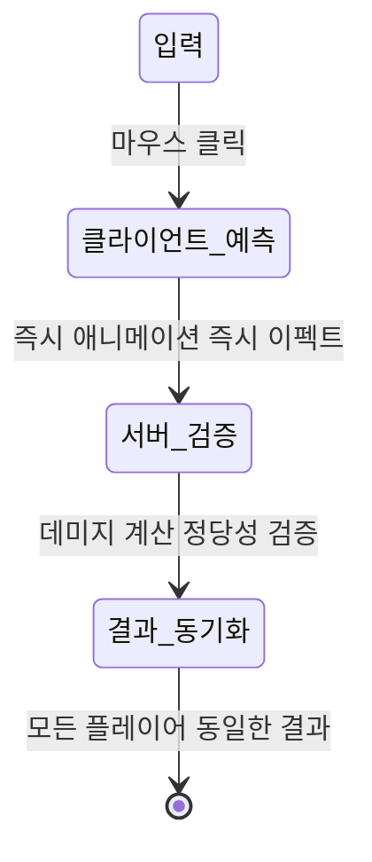

#### 네트워크 기초와 GAS의 접근법

##### 전통적 네트워크 방식의 문제점

- 서버 권위 방식의 한계

```
// 나쁜 예시 - 전통적 서버 권위 방식
void FireSkill()
{
    // 1. 클라이언트가 서버에 요청
    ServerRPC_FireSkill();

    // 2. 서버 응답 기다림... (100ms 지연)
    // 3. 서버가 처리하고 결과 전송... (또 100ms)
    // 4. 이제야 애니메이션 재생

    // 총 200ms 지연! 플레이어는 "렉이다!" 라고 느낌
}
```

- 200ms가 문제인 이유
	- FPS : 0.2초 동안 적이 이미 이동
	- 격투게임 : 60fps 기준 12프레임 지연 (약손 3프레임)
	- 체감 : "내가 누른 게 안 먹혀!"


##### 클라이언트 예측 (Client Prediction)의 원리

- 핵심 아이디어 : "서버 응답 기다리지 말고 일단 보여주자"

```
// GAS의 예측 방식
void FireSkill_WithPrediction()
{
    if (IsLocallyControlled())
    {
        // 예측 윈도우 열기
        FScopedPredictionWindow PredictionWindow(ASC, true);

        // 즉시 시각 피드백
        PlayAnimation();
        ShowSkillEffect();

        // GameplayEffect로 예측 적용
        FGameplayEffectSpecHandle CostSpec = MakeOutgoingSpec(CostEffect);
        FGameplayEffectSpecHandle CooldownSpec = MakeOutgoingSpec(CooldownEffect);

        ASC->ApplyGameplayEffectSpecToSelf(*CostSpec.Data.Get());
        ASC->ApplyGameplayEffectSpecToSelf(*CooldownSpec.Data.Get());
    }

    // 동시에 서버 요청
    SendToServer_UseSkill();
}
```


##### 롤백 (Rollback) 매커니즘

- 예측이 틀렸을 때의 처리

```
// 롤백 과정
ClientState = {
    Mana: 100 → 50      // 예측: 마나 감소
    Animation: "Casting" // 애니메이션 시작
    Effect: "Fire"       // 이펙트 표시
    Cooldown: 5.0s       // 쿨다운 시작
}

// 서버 응답: "마나 부족!"
ServerResponse = {
    Success: false,
    Reason: "Not enough mana",
    ActualMana: 30
}

// 클라이언트 롤백
RollbackProcess = {
    RemoveEffect("Fire");
    StopAnimation();
    Mana: 50 → 30;
    Cooldown: Cancel();
    ShowMessage("마나가 부족합니다!");
}
```


##### Prediction Key - 예측의 추적 시스템

- FPredictionKey의 실제 구조

```
struct FPredictionKey
{
    int16 Current;    // 현재 예측 번호 (0~65535)
    int16 Base;       // 서버가 확인한 마지막 번호
    bool bIsServerInitiated;  // 서버가 시작한 액션인가?
};

// 예측 키 사용 예시
void ActivateFireballAbility()
{
    // 1. 새 예측 키 생성
    FPredictionKey PredictionKey = ASC->GetPredictionKeyForNewAction();

    // 2. 예측 윈도우 열기
    FScopedPredictionWindow Window(ASC, PredictionKey);

    // 3. 예측 실행 (모두 #42로 태그됨)
    ApplyGameplayEffect(CostEffect);      // 마나 -50 (예측 #42)
    ApplyGameplayEffect(CooldownEffect);  // 쿨다운 5초 (예측 #42)
    ApplyGameplayEffect(PowerUpEffect);   // 공격력 +10 (예측 #42)

    // 4. 서버에 키와 함께 전송
    ServerRPC_ActivateAbility(PredictionKey);
}
```

- int16인 이유
	- 메모리 효율 (65,536개면 충분)
	- 네트워크 최적화 (작은 패킷)
	- 롤오버 안전성

```
void ServerRPC_ActivateAbility(FPredictionKey PredictionKey)
{
    if (PlayerHasEnoughMana() && 
        AbilityNotOnCooldown() && 
        PlayerNotStunned())
    {
        ASC->ReplicatedPredictionKeyMap.Add(PredictionKey, true);
        BroadcastToOtherPlayers("이 플레이어가 파이어볼 썼음");
    }
    else
    {
        ASC->ReplicatedPredictionKeyMap.Add(PredictionKey, false);
        SendFailureReason("Not enough mana");
    }
}
```

```
void ComboExample()
{
    UseSkill_Dash();        // → Prediction Key #40
    UseSkill_Attack();      // → Prediction Key #41
    UseSkill_Dodge();       // → Prediction Key #42
}
```


#### Ability Activation 정책 심화

##### NetExecutionPolicy

```
enum class EGameplayAbilityNetExecutionPolicy : uint8
{
    LocalOnly,          // 로컬 전용
    LocalPredicted,     // 클라이언트 예측
    ServerOnly,         // 서버만 실행
    ServerInitiated     // 서버가 시작
};
```

- 각 정책의 사용처

| 정책              | 용도       | 예시            |
| --------------- | -------- | ------------- |
| LocalOnly       | 네트워크 무관  | UI 조작, 카메라 이동 |
| LocalPredicted  | 즉각 반응 필요 | 기본 공격, 이동 스킬  |
| ServerOnly      | 보안 중요    | 아이템 구매, 레벨업   |
| ServerInitiated | 서버 이벤트   | 보스 패턴, 환경 피해  |

- LocalOnly - 나만 아는 액션

```
UInventoryAbility::UInventoryAbility()
{
    NetExecutionPolicy = LocalOnly;
}

void UInventoryAbility::ActivateAbility(...)
{
    OpenInventoryWidget();  // 즉시 실행, 네트워크 통신 없음
}
```

- LocalPredicted - 대부분의 전투 액션

```
UDashAbility::UDashAbility()
{
    NetExecutionPolicy = LocalPredicted;
}

void UDashAbility::ActivateAbility(...)
{
    if (IsLocallyControlled())
    {
        PerformDash();      // 즉시 실행 (0ms)
        PlayDashEffect();
    }

    if (HasAuthority())
    {
        if (CanDash())
        {
            MulticastDashEffect();
        }
        else
        {
            ClientRollbackDash();
        }
    }
}
```

- ServerOnly - 중요한 결정

```
UPurchaseItemAbility::UPurchaseItemAbility()
{
    NetExecutionPolicy = ServerOnly;
}

void UPurchaseItemAbility::ActivateAbility(...)
{
    if (!HasAuthority())
    {
        ShowPurchasingUI();
        return;
    }

    if (PlayerGold >= ItemPrice)
    {
        PlayerGold -= ItemPrice;
        AddItemToInventory(ItemID);
        ClientRPC_PurchaseSuccess(ItemID);
    }
}
```

- ServerInitiated - 서버 이벤트

```
UBossAreaAttack::UBossAreaAttack()
{
    NetExecutionPolicy = ServerInitiated;
}

void UBossAreaAttack::ActivateAbility(...)
{
    if (HasAuthority())
    {
        CalculateDamageArea();
        MulticastExecuteAreaAttack();
    }
}
```


##### LocalPredicted 심화

- 실제 구현 패턴

```
void UMyMeleeAbility::ActivateAbility(...)
{
    // 예측 윈도우 열기
    FScopedPredictionWindow PredictionWindow(ASC, true);

    // 즉시 실행
    PlayMontage(AttackMontage);
    ExecuteGameplayCue("GameplayCue.Swing");
    PlaySound(SwingSound);

    // CommitAbility가 비용과 쿨다운 처리
    if (!CommitAbility(...))
    {
        EndAbility(...);
        return;
    }
}
```

- FScopedPredictionWindow 사용법
	- `FScopedPredictionWindow(ASC, true)` - 새 키 생성
	- `FScopedPredictionWindow(ASC, ExistingKey)` - 기존 키 사용


##### 서버 권위와 클라이언트 자유의 균형

```
// 경쟁 게임 (서버 권위 90%)
UMyCompetitiveAbility::UMyCompetitiveAbility()
{
    NetExecutionPolicy = ServerOnly;
    bServerRespectsRemoteAbilityCancellation = false;
    bReplicateInputDirectly = false;
}

// 캐주얼 게임 (클라이언트 자유 70%)
UMyCasualAbility::UMyCasualAbility()
{
    NetExecutionPolicy = LocalPredicted;
    bServerRespectsRemoteAbilityCancellation = true;
    bReplicateInputDirectly = true;
}

// 배틀로얄 (하이브리드)
void UBattleRoyaleAbility::ActivateAbility(...)
{
    float DistanceToEnemy = GetDistanceToNearestEnemy();

    if (DistanceToEnemy < 1000.0f)  // 10미터 이내
    {
        SetNetExecutionPolicy(ServerOnly);  // 근접전: 서버 권위
    }
    else
    {
        SetNetExecutionPolicy(LocalPredicted);  // 원거리: 예측
    }
}
```


#### 실습 : 예측형 근접 공격 구현

##### 시스템 설계 요구사항

- 우리가 만들 시스템
	- 다크소울 스타일의 근접 전투 시스템을 구현
	- 클릭 -> 즉시 공격 모션
	- 정확한 타이밍에 데미지
	- 네트워크 플레이 완벽 지원
	- 부드러운 롤백 처리

- 상세 요구사항
	- **반응성 (Responsiveness)**
		- 입력 지연 : 0ms (즉시 반응)
		- 애니메이션 시작 : 즉시
		- 이펙트 표시 : 즉시
	- **정확성 (Accuracy)**
		- 칼날이 닿는 정확한 프레임에 히트
		- 히트박스 정확한 판정
		- 서버 권위 판정
	- **안전성 (Security)**
		- 서버가 최종 데미지 결정
		- 치팅 방지
		- 네트워크 에러 처리

- 시스템 구조




##### GameplayTag 설정

- 태그 네이밍 규칙

>GameplayCue 태그는 반드시 'GameplayCue'로 시작
>	이유
>		- 엔진이 자동으로 Cue 애셋 찾기
>		- 최적화된 로딩/언로딩
>		- 네트워크 복제 최적화
{: .prompt-tip}

- 태그 계층 구조

```
Ability.
├── Melee.
│   ├── Light      (약공격)
│   ├── Heavy      (강공격)
│   └── Counter    (카운터)

Event.
├── Melee.
│   ├── Hit        (타격)
│   ├── Block      (방어)
│   └── Parry      (패링)

GameplayCue.       (반드시 이 접두사!)
├── Melee.
│   ├── Swing      (휘두르기)
│   ├── Hit        (타격)
│   └── Blood      (피 효과)

SetByCaller.
├── Damage         (데미지 값)
├── Force          (넉백 힘)
└── Critical       (크리티컬 배수)

```

- 코드 구현

```
// L18GameplayTags.h
namespace L18Tags
{
    // Ability 태그
    UE_DECLARE_GAMEPLAY_TAG_EXTERN(Ability_Melee);
    UE_DECLARE_GAMEPLAY_TAG_EXTERN(Ability_Melee_Light);
    UE_DECLARE_GAMEPLAY_TAG_EXTERN(Ability_Melee_Heavy);

    // Event 태그
    UE_DECLARE_GAMEPLAY_TAG_EXTERN(Event_Melee_Hit);
    UE_DECLARE_GAMEPLAY_TAG_EXTERN(Event_Melee_HitConfirm);
    UE_DECLARE_GAMEPLAY_TAG_EXTERN(Event_Combo_Window_Open);

    // GameplayCue 태그 (반드시 "GameplayCue."로 시작!)
    UE_DECLARE_GAMEPLAY_TAG_EXTERN(Cue_Melee_Swing);
    UE_DECLARE_GAMEPLAY_TAG_EXTERN(Cue_Melee_Hit);
    UE_DECLARE_GAMEPLAY_TAG_EXTERN(Cue_Melee_Hit_Blood);

    // SetByCaller 태그
    UE_DECLARE_GAMEPLAY_TAG_EXTERN(SetByCaller_Damage);
    UE_DECLARE_GAMEPLAY_TAG_EXTERN(SetByCaller_Damage_Critical);
    UE_DECLARE_GAMEPLAY_TAG_EXTERN(SetByCaller_Force);
}
```

```
// L18GameplayTags.cpp
namespace L18Tags
{
    // Ability 태그 정의
    UE_DEFINE_GAMEPLAY_TAG_COMMENT(Ability_Melee,
        "Ability.Melee",
        "Base tag for all melee abilities");
    UE_DEFINE_GAMEPLAY_TAG(Ability_Melee_Light, "Ability.Melee.Light");
    UE_DEFINE_GAMEPLAY_TAG(Ability_Melee_Heavy, "Ability.Melee.Heavy");

    // Event 태그 정의
    UE_DEFINE_GAMEPLAY_TAG(Event_Melee_Hit, "Event.Melee.Hit");
    UE_DEFINE_GAMEPLAY_TAG(Event_Melee_HitConfirm, "Event.Melee.HitConfirm");
    UE_DEFINE_GAMEPLAY_TAG(Event_Combo_Window_Open, "Event.Combo.Window.Open");

    // 올바른 GameplayCue 태그
    UE_DEFINE_GAMEPLAY_TAG(Cue_Melee_Swing, "GameplayCue.Melee.Swing");
    UE_DEFINE_GAMEPLAY_TAG(Cue_Melee_Hit, "GameplayCue.Melee.Hit");
    UE_DEFINE_GAMEPLAY_TAG(Cue_Melee_Hit_Blood, "GameplayCue.Melee.Hit.Blood");

    // 잘못된 예시 (작동 안 함!)
    // UE_DEFINE_GAMEPLAY_TAG(Wrong_Cue, "Cue.Attack");

    // SetByCaller 태그 정의
    UE_DEFINE_GAMEPLAY_TAG(SetByCaller_Damage, "SetByCaller.Damage");
    UE_DEFINE_GAMEPLAY_TAG(SetByCaller_Damage_Critical, "SetByCaller.Damage.Critical");
    UE_DEFINE_GAMEPLAY_TAG(SetByCaller_Force, "SetByCaller.Force");
}

```

- 네이티브 태그의 장점
	1. 컴파일 타임 체크
	```
	// 오타를 컴파일 타임에 잡음
	if (AbilityTags.HasTag(L18Tags::Ability_Melee))

	// 오타를 런타임에야 발견
	if (AbilityTags.HasTag("Ability.Melle"))  // 오타!
	```

	2. 태그 계층 활용
	```
	// 상위 태그로 하위 태그들 체크
	if (AbilityTags.HasTag(L18Tags::Ability_Melee))
	{
	    // Ability.Melee.Light, Heavy 모두 해당
	}

	// 정확한 매칭
	if (AbilityTags.HasTagExact(L18Tags::Ability_Melee_Light))
	{
	    // Ability.Melee.Light만 해당
	}
	```


##### Melee 구현

- 클래스 구조

```
// L18Ability_Melee.h
UCLASS()
class UL18Ability_Melee : public UGameplayAbility
{
    GENERATED_BODY()

public:
    UL18Ability_Melee();

    virtual void ActivateAbility(
        const FGameplayAbilitySpecHandle Handle,
        const FGameplayAbilityActorInfo* ActorInfo,
        const FGameplayAbilityActivationInfo ActivationInfo,
        const FGameplayEventData* TriggerEventData
    ) override;

    virtual void EndAbility(
        const FGameplayAbilitySpecHandle Handle,
        const FGameplayAbilityActorInfo* ActorInfo,
        const FGameplayAbilityActivationInfo ActivationInfo,
        bool bReplicateEndAbility,
        bool bWasCancelled
    ) override;

protected:
    // 핵심 함수
    void PerformMeleeAttack();
    void ApplyDamageToTarget(AActor* Target);
    TArray<AActor*> PerformHitDetection(const FVector& HitLocation);

    // 타이머 핸들
    FTimerHandle HitCheckTimer;
    FTimerHandle EndAbilityTimer;

    // 설정 프로퍼티
    UPROPERTY(EditDefaultsOnly, Category = "Animation")
    UAnimMontage* AttackMontage;

    UPROPERTY(EditDefaultsOnly, Category = "Damage")
    TSubclassOf<UGameplayEffect> DamageEffectClass;

    UPROPERTY(EditDefaultsOnly, Category = "Damage")
    float BaseDamage = 20.0f;

    UPROPERTY(EditDefaultsOnly, Category = "Damage")
    float CriticalChance = 10.0f;

    UPROPERTY(EditDefaultsOnly, Category = "Damage")
    float CriticalMultiplier = 2.0f;

    UPROPERTY(EditDefaultsOnly, Category = "HitDetection")
    float HitRadius = 100.0f;

    UPROPERTY(EditDefaultsOnly, Category = "HitDetection")
    float HitRange = 150.0f;

    UPROPERTY(EditDefaultsOnly, Category = "Timing")
    float HitCheckDelay = 0.4f;  // 애니메이션의 40% 지점
};

```

- 생성자 구현

```
UL18Ability_Melee::UL18Ability_Melee()
{
    // 실행마다 새 인스턴스 (콤보 가능)
    InstancingPolicy = EGameplayAbilityInstancingPolicy::InstancedPerExecution;

    // 클라이언트 예측 (즉각 반응)
    NetExecutionPolicy = EGameplayAbilityNetExecutionPolicy::LocalPredicted;

    // 클라이언트 취소 존중
    bServerRespectsRemoteAbilityCancellation = true;

    // 태그 설정
    AbilityTags.AddTag(L18Tags::Ability_Melee);
    BlockAbilitiesWithTag.AddTag(FGameplayTag::RequestGameplayTag("State.Stunned"));
    BlockAbilitiesWithTag.AddTag(FGameplayTag::RequestGameplayTag("State.Dead"));
}

```

- ActivateAbility 구현

```
void UL18Ability_Melee::ActivateAbility(
    const FGameplayAbilitySpecHandle Handle,
    const FGameplayAbilityActorInfo* ActorInfo,
    const FGameplayAbilityActivationInfo ActivationInfo,
    const FGameplayEventData* TriggerEventData)
{
    // 1. 리소스 체크 (마나, 쿨다운)
    if (!CommitAbility(Handle, ActorInfo, ActivationInfo))
    {
		    if (IsLocallyControlled())
		    {
				    ShowErrorMessage("스태미나 부족함");
				    PlayErrorSound();
		    }
		    
        EndAbility(Handle, ActorInfo, ActivationInfo, true, true);
        return;
    }

    UAbilitySystemComponent* ASC = ActorInfo->AbilitySystemComponent.Get();
    if (!ASC)
    {
        EndAbility(Handle, ActorInfo, ActivationInfo, true, true);
        return;
    }

    // 2. 예측 GameplayCue (즉시 시각 효과)
    if (IsLocallyControlled() &&
        GetNetExecutionPolicy() == EGameplayAbilityNetExecutionPolicy::LocalPredicted)
    {
        FScopedPredictionWindow PredictionWindow(ASC, true);

        FGameplayCueParameters CueParams;
        CueParams.SourceObject = GetAvatarActorFromActorInfo();
        CueParams.Location = GetAvatarActorFromActorInfo()->GetActorLocation();

        // 스윙 이펙트 (칼 궤적)
        ASC->ExecuteGameplayCue(L18Tags::Cue_Melee_Swing, CueParams);
    }

    // 3. 몽타주 재생 (직접 처리)
    if (AttackMontage)
    {
        // 몽타주 재생
        float AnimDuration = PlayMontage(
            AttackMontage,
            1.0f,        // 재생 속도
            NAME_None    // 시작 섹션
        );

        // 히트 체크 타이밍 (애니메이션 중간)
        GetWorld()->GetTimerManager().SetTimer(
            HitCheckTimer,
            this,
            &UL18Ability_Melee::PerformMeleeAttack,
            HitCheckDelay,
            false
        );

        // 애니메이션 끝나면 Ability 종료
        GetWorld()->GetTimerManager().SetTimer(
            EndAbilityTimer,
            [this, Handle, ActorInfo, ActivationInfo]()
            {
                EndAbility(Handle, ActorInfo, ActivationInfo, true, false);
            },
            AnimDuration,
            false
        );
    }
    else
    {
        // 몽타주 없으면 즉시 공격
        PerformMeleeAttack();
        EndAbility(Handle, ActorInfo, ActivationInfo, true, false);
    }
}

```

- 근접 공격 수행

```
void UL18Ability_Melee::PerformMeleeAttack()
{
    const FGameplayAbilityActorInfo* Info = GetCurrentActorInfo();
    UAbilitySystemComponent* ASC = Info ? Info->AbilitySystemComponent.Get() : nullptr;
    if (!ASC) return;

    // 클라이언트: 예측 히트 이펙트
    if (IsLocallyControlled())
    {
        FScopedPredictionWindow PredictionWindow(ASC, true);

        // 히트 위치 계산
        FVector Forward = GetAvatarActorFromActorInfo()->GetActorForwardVector();
        FVector ActorLoc = GetAvatarActorFromActorInfo()->GetActorLocation();
        FVector HitLocation = ActorLoc + (Forward * HitRange);

        FGameplayCueParameters HitParams;
        HitParams.Location = HitLocation;

        // 히트 이펙트
        ASC->ExecuteGameplayCue(L18Tags::Cue_Melee_Hit, HitParams);

        // 컨트롤러 진동
        if (APlayerController* PC = Info->PlayerController.Get())
        {
            PC->PlayDynamicForceFeedback(0.5f, 0.2f, true, true, true, true);
        }
    }

    // 서버: 실제 데미지 적용
    if (HasAuthority(&CurrentActivationInfo))
    {
        FVector AttackLocation = GetAvatarActorFromActorInfo()->GetActorLocation();
        TArray<AActor*> HitActors = PerformHitDetection(AttackLocation);

        for (AActor* Target : HitActors)
        {
            ApplyDamageToTarget(Target);
        }

        // 서버 확정 Cue
        FGameplayCueParameters ServerParams;
        ServerParams.Location = AttackLocation;
        ASC->ExecuteGameplayCue(L18Tags::Cue_Melee_Hit, ServerParams);
    }
}

```

- 히트 감지

```
TArray<AActor*> UL18Ability_Melee::PerformHitDetection(const FVector& HitLocation)
{
    TArray<AActor*> HitActors;

    // 콜리전 설정
    FCollisionQueryParams QueryParams;
    QueryParams.AddIgnoredActor(GetAvatarActorFromActorInfo());
    QueryParams.bTraceComplex = false;

    // 구체 스윕
    FVector Start = GetAvatarActorFromActorInfo()->GetActorLocation();
    FVector End = Start + (GetAvatarActorFromActorInfo()->GetActorForwardVector() * HitRange);

    TArray<FHitResult> HitResults;
    GetWorld()->SweepMultiByChannel(
        HitResults,
        Start,
        End,
        FQuat::Identity,
        ECC_GameTraceChannel1,  // Combat 채널
        FCollisionShape::MakeSphere(HitRadius),
        QueryParams
    );

    // 필터링
    for (const FHitResult& Hit : HitResults)
    {
        AActor* HitActor = Hit.GetActor();

        if (!HitActor) continue;
        if (HitActors.Contains(HitActor)) continue;
        if (!UAbilitySystemGlobals::GetAbilitySystemComponentFromActor(HitActor)) continue;

        HitActors.Add(HitActor);
    }

    return HitActors;
}

```

- 데미지 적용

```
void UL18Ability_Melee::ApplyDamageToTarget(AActor* Target)
{
    if (!Target || !DamageEffectClass) return;

    const FGameplayAbilityActorInfo* Info = GetCurrentActorInfo();
    UAbilitySystemComponent* SourceASC = Info ? Info->AbilitySystemComponent.Get() : nullptr;
    if (!SourceASC) return;

    UAbilitySystemComponent* TargetASC =
        UAbilitySystemGlobals::GetAbilitySystemComponentFromActor(Target);
    if (!TargetASC) return;

    // GameplayEffect 스펙 생성
    FGameplayEffectSpecHandle DamageSpec =
        MakeOutgoingGameplayEffectSpec(DamageEffectClass, GetAbilityLevel());

    if (!DamageSpec.IsValid()) return;

    // 데미지 계산
    float FinalDamage = BaseDamage;
    bool bIsCritical = (FMath::RandRange(0.0f, 100.0f) < CriticalChance);

    if (bIsCritical)
    {
        FinalDamage *= CriticalMultiplier;

        // 크리티컬 이펙트
        FGameplayCueParameters CritParams;
        CritParams.Location = Target->GetActorLocation();
        TargetASC->ExecuteGameplayCue(
            FGameplayTag::RequestGameplayTag("GameplayCue.Damage.Critical"),
            CritParams
        );
    }

    // SetByCaller 데이터
    DamageSpec.Data->SetSetByCallerMagnitude(L18Tags::SetByCaller_Damage, FinalDamage);
    DamageSpec.Data->SetSetByCallerMagnitude(L18Tags::SetByCaller_Damage_Critical, bIsCritical ? 1.0f : 0.0f);
    DamageSpec.Data->SetSetByCallerMagnitude(L18Tags::SetByCaller_Force, 500.0f);

    // Effect 적용
    FActiveGameplayEffectHandle EffectHandle =
        SourceASC->ApplyGameplayEffectSpecToTarget(*DamageSpec.Data.Get(), TargetASC);

    if (EffectHandle.IsValid() && IsLocallyControlled())
    {
        ShowDamageNumber(Target->GetActorLocation(), FinalDamage, bIsCritical);
    }
}
```

- Ability 종료

```
void UL18Ability_Melee::EndAbility(
    const FGameplayAbilitySpecHandle Handle,
    const FGameplayAbilityActorInfo* ActorInfo,
    const FGameplayAbilityActivationInfo ActivationInfo,
    bool bReplicateEndAbility,
    bool bWasCancelled)
{
    // 타이머 정리
    if (GetWorld())
    {
        GetWorld()->GetTimerManager().ClearTimer(HitCheckTimer);
        GetWorld()->GetTimerManager().ClearTimer(EndAbilityTimer);
    }

    // 몽타주 중단
    if (bWasCancelled)
    {
        StopMontage();
    }

    Super::EndAbility(Handle, ActorInfo, ActivationInfo, bReplicateEndAbility, bWasCancelled);
}

```


##### 애니메이션 설정 (에디터)

- 몽타주 설정
	- 단계별 과정
		1. 몽타주 생성
			- Content Browser -> Animation -> Animation Montage
			- 이름 : AM_MeleeAttack_Light
		2. 타이밍 설정
			- 공격 애니메이션의 40% 지점이 타격 시점
			- 30fps 기준 12프레임 (0.4초)
		3. 블루프린트에서 히트 타이밍 조절
			- Ability 블루프린트에서 HitCheckDelay 프로퍼티 조절
			- 애니메이션에 맞게 미세조정